# Fuego Source Code Fork Classification System

## Overview

This document provides a comprehensive classification system for all changes in Fuego source code, organized by their fork requirements. The system helps developers, node operators, and the community understand the impact of proposed changes and plan accordingly.

## Fork Classification Levels

### 🔴 **Hard Fork Required**
Changes that break consensus and require all nodes to upgrade simultaneously.

### 🟡 **Soft Fork Compatible**  
Changes that are backward compatible but may require coordination.

### 🟢 **No Fork / On-the-Fly**
Changes that can be deployed without any network coordination.

---

## Mermaid Diagrams

### Fork Classification Flow

```mermaid
graph TD
    A[Proposed Change] --> B{Consensus Impact?}
    B -->|Yes| C[🔴 Hard Fork]
    B -->|No| D{Network Protocol?}
    D -->|Yes| E[🟡 Soft Fork]
    D -->|No| F[🟢 No Fork]
    
    C --> G[All nodes must upgrade]
    E --> H[Gradual adoption]
    F --> I[Immediate deployment]
    
    C --> J[Requires coordination]
    E --> K[Monitoring required]
    F --> L[Standard release]
```



### Change Impact Matrix

```mermaid
graph LR
    A[Change Type] --> B[Consensus]
    A --> C[Protocol]
    A --> D[UI/UX]
    A --> E[Build/Dev]
    
    B --> F[🔴 Hard Fork]
    C --> G[🟡 Soft Fork]
    D --> H[🟢 No Fork]
    E --> I[🟢 No Fork]
    
    F --> J[Network Upgrade]
    G --> K[Compatibility Check]
    H --> L[User Update]
    I --> M[Developer Update]
```



### Implementation Workflow

```mermaid
flowchart TD
    A[Change Proposal] --> B{Fork Level?}
    
    B -->|🔴 Hard Fork| C[Community Review]
    C --> D[Reference Implementation]
    D --> E[Network Coordination]
    E --> F[Simultaneous Upgrade]
    
    B -->|🟡 Soft Fork| G[Backward Compatible]
    G --> H[Gradual Deployment]
    H --> I[Monitoring]
    
    B -->|🟢 No Fork| J[Standard Development]
    J --> K[Testing]
    K --> L[Release]
    
    F --> M[Network Active]
    I --> M
    L --> M
```



---

## 🔴 HARD FORK REQUIRED

### Core Consensus Changes

#### Block Structure & Validation
- **Block Header Format Changes**
  - Adding/removing fields from block header
  - Changing hash algorithms or nonce structures
  - Modifying Merkle tree structures
  
- **Transaction Format Changes**
  - Adding/removing transaction fields
  - Modifying input/output structures
  - Changing signature schemes
  
- **Consensus Rule Changes**
  - Block size limit modifications
  - Difficulty adjustment algorithm changes
  - Reward structure modifications
  - Block time adjustments

#### Cryptographic Changes
- **Hash Algorithm Changes**
  - Switching from CryptoNight to new algorithm
  - Modifying hash function parameters
  - Changing proof-of-work requirements
  
- **Signature Scheme Changes**
  - Moving from EdDSA to different scheme
  - Changing key derivation methods
  - Modifying ring signature parameters

#### Network Protocol Changes
- **P2P Protocol Changes**
  - Changing message formats
  - Modifying peer discovery mechanisms
  - Altering block propagation rules
  
- **Address Format Changes**
  - Changing address encoding schemes
  - Modifying public key formats
  - Altering payment ID structures

### Economic Model Changes

#### Monetary Policy
- **Supply Changes**
  - Modifying emission curves
  - Changing maximum supply
  - Adjusting reward schedules
  
- **Fee Structure Changes**
  - Modifying minimum fee calculations
  - Changing fee distribution mechanisms
  - Altering fee burning rules

#### Smart Contract Changes
- **Virtual Machine Changes**
  - Modifying VM instruction sets
  - Changing gas calculation
  - Altering contract execution rules

### Database Schema Changes
- **Blockchain Storage**
  - Changing block storage format
  - Modifying transaction indexing
  - Altering state database structure

---

## 🟡 SOFT FORK COMPATIBLE

### Network Improvements

#### Protocol Enhancements
- **Block Propagation**
  - Implementing compact block relay
  - Adding block compression
  - Improving transaction relay
  
- **Peer Discovery**
  - Adding new discovery mechanisms
  - Modifying peer selection algorithms
  - Enhancing network topology

#### Privacy Enhancements
- **Ring Signature Improvements**
  - Increasing ring size limits
  - Adding new signature types
  - Improving mixing algorithms
  
- **Address Privacy**
  - Adding stealth address improvements
  - Enhancing payment ID security
  - Improving transaction graph analysis resistance

### Performance Optimizations
- **Database Optimizations**
  - Adding new indexes
  - Modifying cache strategies
  - Improving query performance
  
- **Memory Usage**
  - Optimizing data structures
  - Reducing memory footprint
  - Improving garbage collection

### API and RPC Changes
- **New RPC Methods**
  - Adding query functions
  - Enhancing wallet RPC
  - Improving monitoring capabilities
  
- **API Enhancements**
  - Adding new parameters
  - Improving error handling
  - Enhancing response formats

---

## 🟢 NO FORK / ON-THE-FLY CHANGES

### User Interface Improvements
- **CLI Enhancements**
  - Adding new command-line options
  - Improving help text
  - Enhancing logging output
  
- **Web Interface**
  - Updating web UI
  - Adding new dashboard features
  - Improving user experience

### Documentation and Configuration
- **Configuration Options**
  - Adding new configuration parameters
  - Modifying default values
  - Improving configuration validation
  
- **Documentation Updates**
  - Updating README files
  - Adding code comments
  - Improving API documentation

### Build System and Development
- **Build Improvements**
  - Adding new build targets
  - Improving compilation speed
  - Enhancing cross-platform support
  
- **Development Tools**
  - Adding debugging tools
  - Improving testing infrastructure
  - Enhancing code analysis

### Monitoring and Observability
- **Metrics and Telemetry**
  - Adding new metrics
  - Improving monitoring dashboards
  - Enhancing alerting systems
  
- **Logging Improvements**
  - Adding structured logging
  - Improving log levels
  - Enhancing log filtering

---

## Implementation Guidelines

### Hard Fork Process


### Soft Fork Process


### No Fork Process


---

## Change Management Workflow

### Impact Assessment Matrix

```mermaid
graph TD
    A[Proposed Change] --> B{Consensus Impact?}
    B -->|Yes| C{Network Impact?}
    B -->|No| D{User Impact?}
    
    C -->|High| E[🔴 Hard Fork]
    C -->|Medium| F[🟡 Soft Fork]
    C -->|Low| G[🟢 No Fork]
    
    D -->|High| H[🟡 Soft Fork]
    D -->|Medium| I[🟢 No Fork]
    D -->|Low| J[🟢 No Fork]
```



### Coordination Requirements

| Fork Level | Coordination Required | Deployment Strategy | Rollback Plan |
|------------|----------------------|-------------------|---------------|
| 🔴 Hard Fork | Full network coordination | Simultaneous upgrade | Pre-defined rollback |
| 🟡 Soft Fork | Monitoring and gradual adoption | Gradual deployment | Automatic fallback |
| 🟢 No Fork | Standard procedures | Standard release | Standard rollback |

---

## Examples by Category

### Hard Fork Examples

```cpp
// BLOCK: Changes block header structure
struct BlockHeader {
    uint8_t majorVersion;     // Changed from uint32_t
    uint8_t minorVersion;     // New field
    uint64_t timestamp;       // Changed format
    // ... other changes
};

// BLOCK: Modifies consensus rules
bool validateTransaction(const Transaction& tx) {
    // Changed validation logic that breaks existing transactions
}
```

### Soft Fork Examples

```cpp
// NETWORK: Adds new optional fields
struct BlockHeader {
    uint32_t majorVersion;
    uint32_t minorVersion;
    uint64_t timestamp;
    // New optional fields that older nodes can ignore
    std::optional<uint64_t> newField;
};

// PERFORMANCE: Improves existing algorithm
std::vector<Transaction> optimizeTransactionSelection() {
    // Improved algorithm that produces same results
}
```

### No Fork Examples

```cpp
// UI: Improves user interface
void printTransactionDetails(const Transaction& tx) {
    // Better formatting and additional information
    std::cout << "Transaction: " << tx.hash << std::endl;
    std::cout << "Amount: " << formatAmount(tx.amount) << std::endl;
}

// LOGGING: Enhanced logging
void logBlockValidation(const Block& block) {
    logger(INFO) << "Validating block " << block.height 
                 << " with hash " << block.hash;
}
```

---

## Maintenance and Updates

### Version Control Strategy


### Review Process

1. **Technical Review**: Assess implementation quality
2. **Security Review**: Identify potential vulnerabilities  
3. **Community Review**: Gather feedback from stakeholders
4. **Documentation Review**: Ensure proper documentation
5. **Testing Review**: Verify test coverage and quality

### Update Schedule

- **Weekly**: Review new change proposals
- **Monthly**: Update classification guidelines
- **Quarterly**: Review and refine the system
- **As needed**: Emergency updates for critical issues

---

## Conclusion

This classification system provides a clear framework for understanding the impact of code changes in the Fuego network. By following these guidelines, the community can ensure that changes are implemented safely and with appropriate coordination, maintaining network stability while enabling innovation and improvement.

The system is designed to be:
- **Clear**: Easy to understand and apply
- **Flexible**: Adaptable to new types of changes
- **Comprehensive**: Covers all aspects of the codebase
- **Maintainable**: Easy to update and improve over time

By using this system, Fuego can maintain its commitment to decentralization, security, and community-driven development while continuing to innovate and improve the network.

---

## 🔍 SOURCE CODE ARCHITECTURE ANALYSIS

### Core System Architecture


### Code Dependency Analysis

#### Critical Consensus Functions


#### Transaction Processing Pipeline


### Function Complexity Analysis

#### High-Impact Functions (Require Hard Fork)
| Function | Complexity | Dependencies | Impact Level |
|----------|------------|--------------|--------------|
| `Currency::getBlockReward` | High | Mining, Consensus | 🔴 Critical |
| `Blockchain::validate_miner_transaction` | High | All transactions | 🔴 Critical |
| `difficulty_target` | Medium | Network stability | 🔴 High |
| `checkProofOfWork` | Medium | Security | 🔴 High |

#### Medium-Impact Functions (Soft Fork Compatible)
| Function | Complexity | Dependencies | Impact Level |
|----------|------------|--------------|--------------|
| `TransactionPool::addTransaction` | Medium | Mempool | 🟡 Medium |
| `Network::handleMessage` | Medium | P2P | 🟡 Medium |
| `Wallet::createTransaction` | Low | User interface | 🟡 Low |

#### Low-Impact Functions (No Fork Required)
| Function | Complexity | Dependencies | Impact Level |
|----------|------------|--------------|--------------|
| `Logger::logMessage` | Low | Debugging | 🟢 Minimal |
| `Config::loadSettings` | Low | Configuration | 🟢 Minimal |
| `UI::displayStatus` | Low | User experience | 🟢 Minimal |

### Code Style and Patterns Analysis

#### Consensus-Critical Code Patterns
```cpp
// Pattern: Error Handling with Context
bool validateTransaction(const Transaction& tx, tx_verification_context& tvc) {
    if (!check_inputs(tx)) {
        tvc.m_verification_failed = true;
        tvc.m_tx_inputs_invalid = true;
        return false;
    }
    return true;
}

// Pattern: Locked Resource Management
LockedBlockchainStorage blockchainLock(m_blockchain);
auto block = blockchainLock.getBlock(height);
// Automatic unlock on scope exit

// Pattern: Atomic Operations
std::atomic<bool> m_starter_message_showed;
if (!m_starter_message_showed.exchange(true)) {
    // One-time initialization
}
```

#### Performance-Critical Code Patterns
```cpp
// Pattern: Pre-allocation for Performance
std::vector<size_t> lastBlocksSizes;
lastBlocksSizes.reserve(m_currency.rewardBlocksWindow());

// Pattern: Move Semantics
Transaction createMinerTx(Transaction&& baseTx) {
    return std::move(baseTx); // Avoid copy
}

// Pattern: Efficient Hash Calculation
Crypto::Hash calculateHash(const Block& block) {
    return getObjectHash(block); // Optimized serialization
}
```

### Module Interdependence Analysis


### Code Quality Metrics

#### Maintainability Index
- **Consensus Layer**: 65 (High complexity, critical)
- **Network Layer**: 75 (Moderate complexity)
- **Wallet Layer**: 85 (Well-structured, user-focused)
- **Utilities**: 90 (Simple, well-tested)

#### Test Coverage Requirements
- **Consensus Functions**: 95% minimum
- **Network Protocol**: 90% minimum  
- **Transaction Processing**: 95% minimum
- **Error Handling**: 100% required
- **Edge Cases**: 85% minimum

### Security-Critical Code Analysis

#### Cryptographic Functions
```cpp
// High Security Impact - Any change requires Hard Fork
namespace Crypto {
    bool checkSignature(const Hash& hash, const PublicKey& pub, const Signature& sig);
    void generateKeyPair(PublicKey& pub, SecretKey& sec);
    Hash hashToScalar(const void* data, size_t length);
}

// Medium Security Impact - Soft Fork compatible changes
namespace Transaction {
    bool validateRingSignature(const KeyImage& keyImage, const std::vector<PublicKey>& pubKeys);
    bool checkInputTypesSupported(const KeyInput& input);
}
```

#### Validation Functions
```cpp
// Critical Path - Must be atomic and consistent
bool validateBlockTemplate(const Block& block);
bool validateTransactionStructure(const Transaction& tx);
bool validateBlockReward(const Block& block, uint64_t reward);
```

### Performance Bottlenecks and Optimization Points

#### Database Operations
```cpp
// Bottleneck: Block storage and retrieval
bool storeBlock(const Block& block);           // O(log n) - Index operations
std::vector<Block> getBlocks(uint64_t start, uint64_t count); // O(n) - Range queries

// Optimization: Caching frequently accessed data
std::unordered_map<Hash, Block> m_blockCache;  // LRU cache for recent blocks
```

#### Network Operations
```cpp
// Bottleneck: Block propagation and validation
void broadcastBlock(const Block& block);       // Network I/O bound
bool validateAndAddBlock(const Block& block);  // CPU bound validation

// Optimization: Parallel processing
std::thread m_validationThread;                // Async validation
```

### Future Development Considerations

#### Scalability Planning
- **Current**: 8-minute blocks, ~430KB median size
- **Target**: Support 1000+ TPS with sub-second finality
- **Bottlenecks**: Database I/O, network propagation, validation time

#### Upgrade Path Planning
1. **Phase 1**: Optimize existing consensus (Soft Fork)
2. **Phase 2**: Introduce layer-2 solutions (Soft Fork)
3. **Phase 3**: Consensus algorithm upgrade (Hard Fork)
4. **Phase 4**: Sharding implementation (Hard Fork)

### Code Review Guidelines

#### For Hard Fork Changes
- [ ] Full consensus impact analysis
- [ ] Security audit required
- [ ] Extensive test coverage (95%+)
- [ ] Network upgrade coordination plan
- [ ] Rollback procedure defined

#### For Soft Fork Changes
- [ ] Backward compatibility verification
- [ ] Performance impact assessment
- [ ] Gradual deployment strategy
- [ ] Monitoring and alerting setup

#### For No Fork Changes
- [ ] Standard code review process
- [ ] Unit and integration testing
- [ ] Documentation updates
- [ ] User impact assessment
```
</tool_response>
