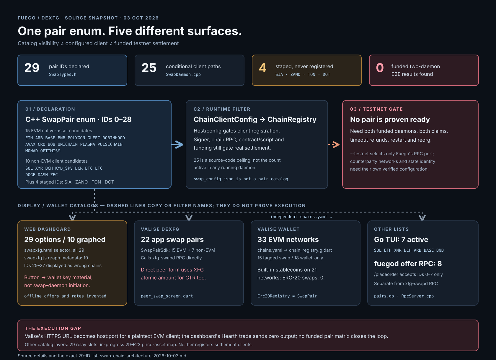

# Swap-chain architecture snapshot — 2026-10-03

This is a source snapshot of two working trees: `/Users/aejt/xfgo` at `906729440` and Valise's `/Users/aejt/DEXFG/fuego-flutter-wallet` checkout. Their separate embedded Fuego source revisions also differ (`a36eccb5` in Valise). A name in a selector is not an executable or tested pair.

## Actual pair inventory

| Status | Pair IDs and names | Count |
|---|---|---:|
| Runtime client code exists, conditional on configuration | `0 SOL`, `1 ETH`, `2 XMR`, `3 BCH`, `4 ARB`, `5 BASE`, `6 KMD_SPV`, `7 BNB`, `8 DCR`, `9 BTC`, `10 LTC`, `11 POLYGON`, `12 GLEEC`, `13 ROBINHOOD`, `14 AVAX`, `15 CRO`, `16 BOB`, `18 UNICHAIN`, `19 PLASMA`, `20 DOGE`, `21 DASH`, `22 ZEC`, `23 PULSECHAIN`, `25 MONAD`, `26 OPTIMISM` | 25 |
| Declared but not registered by the daemon | `17 SIA`, `24 ZANO`, `27 TON`, `28 DOT` | 4 |
| Funded, two-daemon XFG/CTR lock → claim → refund/restart evidence found here | None | 0 |

The 25 are *possible client paths*, not 25 configured clients in a running daemon and not 25 testnet-ready routes. Registration depends on the loaded chain config; the current status JSON does not publish the resulting list. See [pair IDs](../../src/SwapDaemon/SwapTypes.h#L77), [registration](../../src/SwapDaemon/SwapDaemon.cpp#L210), [staged branches](../../src/SwapDaemon/SwapDaemon.cpp#L494), and [registry](../../src/SwapDaemon/ChainRegistry.cpp#L18).

The 15 EVM client paths are ETH, ARB, BASE, BNB, POLYGON, GLEEC, ROBINHOOD, AVAX, CRO, BOB, UNICHAIN, PLASMA, PULSECHAIN, MONAD, and OPTIMISM. The other 10 conditional paths are SOL, XMR, BCH, KMD_SPV, DCR, BTC, LTC, DOGE, DASH, and ZEC. These are native counterparty assets. The [swap parameters](../../src/SwapDaemon/SwapTypes.h#L165) have no token contract/amount route, so there are **zero ERC-20 atomic-swap pairs**.

## The other lists are not the same list

| Surface | Current list | What it actually does |
|---|---|---|
| [fuegod swap offer RPC](../../src/Rpc/RpcServer.cpp#L1461) | IDs 0–7 accepted by `/placeorder`; `/get_open_orders` also loops only 0–7 | Offer API coverage, separate from daemon `initiate_swap`. The open-orders handler does not populate an order result. |
| [Go swapxfg TUI](../../swapxfg/app/pairs.go#L18) | 7: SOL, ETH, XMR, BCH, ARB, BASE, BNB | Its `ActivePairs` display list. KMD has an ID constant but is not active. |
| [Swap offer relay](../../src/CryptoNoteCore/SwapOfferRelay.h#L286) | Storage sized for IDs 0–28 | An orderbook capacity bound, not a settlement-client list. |
| [Web dashboard selector](../../dashboard/static/swapxfg.html#L179) | All 29 | A dropdown, not a runtime-capability check. The [ordergraph metadata](../../dashboard/static/js/swapxfg.js#L23) renders only 10 chains. Its local pair-ID table assigns IDs 25–27 to the wrong names. |
| Valise `SwapPairSdk` (`lib/models/swap_models.dart`) | 22: 15 EVM + SOL, XMR, BCH, KMD, DCR, BTC, LTC | App-side swap IDs, not evidence of lock/claim/refund. DOGE, DASH, ZEC and the four staged pairs are absent. |
| Valise `chains.yaml` → generated `chain_registry.g.dart` | 33 EVM wallet networks: 15 `tier: swap`, 18 `tier: wallet` | Network/RPC/display metadata for wallet use. The 18 wallet-only networks are Linea, ZKsync, HyperEVM, Ink, Rootstock, Gnosis, Flare, Kaia, Scroll, Abstract, Plume, Soneium, Doma, Beam, Moonriver, peaq, Tempo, and Sei. |
| Valise `Erc20Registry` | Built-in stablecoin contracts on 21 of the 33 EVM networks | ERC-20 wallet balances/transfers. Its `supportedChainKeys` currently returns all 33 network keys, including networks without a built-in stable. None creates a token swap route. |
| In-progress `src/SwapDaemon/AssetCatalog.cpp` | 29 pair bindings → 23 settlement-asset descriptors | A separate, currently untracked price-feed catalog; compiled by dirty `src/CMakeLists.txt`, but no live daemon caller of its quote policy was found. It does not register chains or enable trades. |

Valise paths above are in `/Users/aejt/DEXFG/fuego-flutter-wallet`; they are a separate dirty checkout, not files changed for this diagram.

## Why no pair should be marked ready to fund

- `xfg-swapd --testnet` changes the XFG RPC port only. It does not select each counterparty's test network or separate the default swap state directory. The shipped `swap_config.example.json` contains comments (invalid JSON to the loader) and EVM keys such as `eth_host`/`eth_wif` instead of `eth_rpc_host`/`eth_priv_key`. [CLI](../../src/SwapDaemon/main.cpp#L220) · [loader](../../src/SwapDaemon/ChainClientConfig.cpp#L127)
- Valise's `lib/services/swap_config_service.dart` extracts only host and port from HTTPS RPC URLs; the [EVM transport](../../src/SwapDaemon/Ethereum/EthRpcClient.cpp#L255) is plaintext HTTP. EVM routes also require a funded signer and a verified HTLC deployment on *that* chain; many daemon constructors reuse the ETH registry address. Monad defaults to chain ID 185 in the daemon but 143 in Valise's generated registry. [daemon config](../../src/SwapDaemon/ChainClientConfig.cpp#L305)
- BTC testnet WIF, BCH/DOGE/DASH/ZEC testnet address checks, KMD version bytes, XMR network selection, and DCR refund/change handling have source-level blockers in their counterparty clients. SOL has a manual SOL-leg test, not a funded two-daemon XFG swap.
- The [dashboard](../../dashboard/static/js/swapxfg.js#L768) calls wallet `initiate_swap`, which creates transient key material, **not** the [swap-daemon state machine](../../src/SwapDaemon/RpcServer.cpp#L180). It also shows fabricated offers and a fabricated cross-chain rate when offline. Valise's `lib/screens/dex/peer_swap_screen.dart` sets `ctrAmount = xfgAmount` in XFG atomic units, regardless of the counterparty asset's decimals or agreed price.
- Hearth is a separate XFG/HEAT venue. The [dashboard's immediate trade](../../dashboard/static/js/hearth.js#L608) submits `expected_output = 0`; the [wallet builder](../../src/WalletLegacy/WalletTransactionSender.cpp#L2136) rejects it. The dashboard's live depth method is absent from the daemon JSON-RPC dispatcher; the displayed fallback depth is fabricated.

“Ready to test” should mean a testnet-selected RPC and signer, deployed lock contract/program or valid script, confirmed funding, both claim directions, timeout refunds, restart recovery, reorg handling, and a recorded two-daemon result for that exact pair. No pair has that full evidence in these trees.
