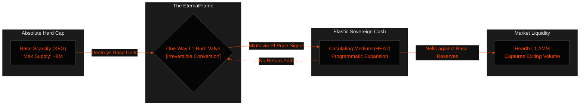

# Why We Burned Digital Scarcity to Mint Sovereign Money

> *"To engineer money that cannot be captured, one must eliminate the temptation of fractional leverage. Scarcity without utility is an idle museum; utility without scarcity is a hyperinflationary graveyard. True economic sovereignty demands a bridge built on irreversible fire."*
>
> — **The AzorAhai Proclamation**

From the earliest cypherpunk experiments, cryptographic asset design has been trapped within a stubborn dichotomy. We create digital gold with deterministic supply caps to protect against state-sponsored dilution, only to realize that hyper-scarce assets make terrible currencies. When individuals anticipate that an asset's purchasing power will double over a multi-year horizon, rational self-interest dictates that they hoard it rather than spend it. 

Conversely, elastic web3 stablecoins have almost uniformly capitulated to centralized banking cartels. By anchoring their reserves in tokenized fiat obligations or fragile multi-sig wrapped collateral bridges, they reintroduce the exact systemic single-points-of-failure that decentralized systems were engineered to destroy.

With the activation of **Fuego v1.10.00 "AzorAhai"**, we reject this compromise. We have integrated a sovereign primitive directly into our base-layer verification rules: the **One-Way Burn2Mint Engine**.

---

## 1. The Fallacy of the Two-Way Bridge

Most dual-token architectures rely on arbitrary minting and redemption loops. In a typical model, burning $1.00 worth of volatile equity mints exactly 1.00 stable unit, and burning 1.00 stable unit re-mints $1.00 worth of volatile equity. 

While mathematically elegant on a spreadsheet, these models carry a fatal vulnerability: **Soros-style short feedback loops**. During a broader market panic, mass redemption of the stable token forces the protocol to hyper-inflate circulating volatile supply to honor exits. This triggers immediate equity freefalls, accelerating panic liquidations until the underlying security budget is exhausted and the system collapses into a black hole.

### The Fuego Resolution: Irreversible Conversion

Fuego eliminates hyperinflationary death spirals by severing the return bridge entirely. 

When an operator burns base-layer **XFG** to mint algorithmic **HEAT Cash**, the transaction output destroys the core units irrevocably (`BankingIndex::addForeverDeposit`). There is no embedded cryptographic call to reverse the operation. 

If a holder wishes to liquidate their **HEAT Cash** back into base-layer **XFG** reserves, they cannot force the network to print new units. Instead, they must route their order organically through the built-in constant-product **Hearth AMM**. This design channels selling pressure into productive volume, allowing the protocol to capture a **1% swap fee** that directly populates the real-yield pools supporting time-locked savers.

---

## 2. The Mechanics of the EternalFlame

Destroying base-layer reserve assets does not equate to absolute asset destruction. To maintain sustained multi-decade blockchain validation security, Fuego implements an internal state tracking primitive known as the **EternalFlame**.

When base units are destroyed inside a validation block, their numeric payload is recorded directly into the base protocol's permanent recycling register. Rather than vanishing forever, these burned values continuously fund programmatic block reward allocations. This guarantees that validation node groups retain highly competitive economic verification incentives long after the hard-coded baseline emission blocks have terminated.

### Base Supply Deflation Mechanics

By anchoring circulating stable money expansion strictly to the execution of one-way collateral destruction, every single real-world commercial transaction settled in **HEAT Cash** directly accelerates base-layer asset scarcity. 

$$\text{Circulating}_{\text{xfg}} = \text{TotalMined}_{\text{xfg}} - \sum \text{BurnedToMint}_{\text{heat}}$$

As algorithmic cash demand scales globally across retail point-of-sale applications and private cross-border networks, the supply of available liquid base-layer collateral shrinks exponentially. This drives programmatic structural upward pricing pressures while preserving absolute transactional cost predictability for enterprise deployment.

---

## 3. Privacy Preservation: Isolated Decoy Sets

True sound money must be perfectly fungible. If a protocol records identifiable historical lineage parameters on-chain, censorship nodes can flag specific tokens, destroying baseline fungibility.

Fuego implements absolute zero-knowledge output isolation to ensure colored stable structures never compromise transactional safety. While both base assets and algorithmic structures write transaction outputs utilizing standard unified tags (`0xD5`), the execution engine evaluates mixing trees independently:

* **Base Layer Verification**: Ring signatures spending base collateral construct decoy matrices exclusively from base ring commitment trees.
* **Algorithmic Cash Verification**: Transactions spending **HEAT Cash** draw mixing elements strictly from verified historical **HEAT** outputs.

This complete mathematical isolation prevents outside observer applications from correlating transaction flows across asset boundaries, ensuring that absolute enterprise financial privacy remains mathematically unassailable.

---

## 4. The Rebel & The Sage: Our Commitment

We did not engineer Fuego to serve as an optimized playground for institutional high-frequency arbitrage desks. We built it to survive an era of unprecedented monetary surveillance and state overreach. 

By burning base digital scarcity to mint elastic sovereign money, we have forged a financial stack that answers only to deterministic code. We welcome developers, privacy advocates, and sovereign infrastructure operators to review our mathematical implementations, audit our open-source repositories, and deploy local node groups to secure the ultimate decentralized standard.

> [!IMPORTANT]
> **Join the Validation Fleet**
> Review our raw fixed-point execution logic, configure local testnet node daemons, and experience native multi-network switching directly through the compiled Go-based TUI binaries. Absolute privacy requires personal verification.

