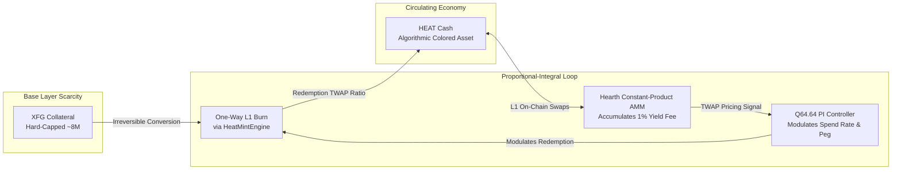

# Algorithmic Stablecoins vs Collateral Assets: The Fuego Architecture

Single-asset decentralized privacy networks have historically encountered an unresolvable trilemma: achieving absolute medium-of-exchange transactional volume while simultaneously preserving a highly restrictive, deflationary store-of-value monetary base. 

Standard unbacked algorithmic stablecoins attempt to resolve this via circular mint/rebasing mechanisms, which reliably terminate in hyperinflationary death spirals during sustained market contractions. **Fuego (XFG) v1.10.00 "AzorAhai"** introduces an immutable, mathematically deterministic resolution: a natively integrated **Dual-Asset Sound Money Architecture**.

---

## 1. The Core Primitives: Collateral (XFG) vs Money (HEAT)

To prevent circular dependencies, Fuego separates the functional roles of its currency ecosystem into two natively tracked output structures inside ring signatures:

### Base-Layer Collateral: Fuego Reserve (XFG)
* **Monetary Policy**: Strictly hard-capped reserve supply (~8,000,000 total units across AMOUNT_TIER structures).
* **Role**: Pure store of value, primary gas/transaction fee vehicle, and ultimate backstop collateral.
* **Recycling Lifecycle**: Burned XFG does not disappear into a black hole; instead, it tracks directly into the **EternalFlame** (`BankingIndex::addForeverDeposit`), recycling organically into sustained future block rewards.

### Algorithmic Cash: HEAT
* **Monetary Policy**: Elastic supply natively bound to L1 demand. Zero hard cap. 
* **Issuance Mechanism**: Strictly minted via one-way, irreversible burning of base-layer **XFG** assets. Reverse minting is strictly banned at the consensus level to prevent inflationary exploitation.
* **Role**: Highly stable, predictable unit of account and medium of exchange optimized for real-world peer-to-peer decentralized commerce.

> [!WARNING]
> **Cryptographic Decoy Pool Independence**
> Standard ring signature constructions mix identical transaction outputs to achieve un-linkability. To preserve zero-knowledge operational safety, Fuego enforces absolute decoy isolation via `encodeAssetAmount(amount, assetId)`. An output containing **HEAT** (`assetId=0x01`) will exclusively pull L1 decoys from the **HEAT** output tree, completely eliminating cross-asset contamination vectors that could reveal real output asset identities.

---

## 2. One-Way Burn2Mint Economics

Standard multi-token architectures rely on exogenous multi-sig bridge contracts or fractional algorithmic reserves. Fuego implements validation rules directly inside the native transaction validation lifecycle (`HeatMintEngine::validateMint`).

When a client initiates a mint transaction, the consensus layer enforces the absolute exchange formula:

$$\text{HEAT}_{\text{minted}} = \frac{\text{XFG}_{\text{consumed}}}{\text{RedemptionPrice}}$$

Where **RedemptionPrice** is not a static scalar, but a highly dynamic variable updated automatically at epoch boundaries by the underlying Proportional-Integral engine. Because the underlying conversion is strictly one-way, liquidity exiting the stable medium must pass organically through the base layer automated market maker.

---

## 3. The Hearth Constant-Product AMM & Real Yield

Natively built into the block verification layer is the **Hearth AMM** (`AmmPool.cpp`). Operating completely independent of external web3 router protocols, Hearth maintains an on-chain constant-product pool ($R_{\text{xfg}} \times R_{\text{heat}} = K$) parameterized with a flat **1% (100 bps) swap fee**.

### Pro-Rata Real Yield Distribution
Rather than enriching centralized validators or distributing highly dilutive, farm-and-dump governance tokens, accumulated Hearth swap fees are automatically harvested every **900 blocks** (one epoch boundary) and distributed programmatically:

* **80% allocated to HEAT Certificate of Deposit (CD) holders**: Yield is settled strictly in **HEAT**, generated by auto-purchasing the circulating cash directly off the Hearth AMM using accumulated XFG swap fees.
* **20% directed to the core infrastructure Treasury**: Ensures long-term protocol sustainability, open-source maintenance funding, and security research grants.

---

## 4. Deterministic Stability: The Q64.64 PI Controller

The absolute centerpiece of the AzorAhai release is the elimination of vulnerable web oracles in favor of internal system spot-pricing loops. Fuego integrates a pure deterministic Proportional-Integral (PI) control loop utilizing custom Q64.64 fixed-point integer arithmetic (`FixedPoint.h`), removing floating-point consensus desynchronization risks across mixed-architecture compiler targets (x86 vs ARM).

### Signal Extraction via Hearth TWAPs
To eliminate flash-loan style single-block price manipulation, the PI controller continuously tracks the Time-Weighted Average Price (TWAP) of the Hearth pool over the full 900-block epoch duration. 

At the epoch boundary, the controller computes the dynamic stability signal:

$$\text{Deviation} = \frac{\text{MarketPrice}_{\text{twap}} - \text{RedemptionPrice}}{\text{RedemptionPrice}}$$

$$\text{RedemptionRate} = (K_p \times \text{Deviation}) + (K_i \times \int \text{Deviation})$$

### Self-Correcting Market Pressures
* **When HEAT trades below peg (Cheap)**: The PI controller increases the **spend rate** above $1.0\times$, aggressively drawing from the protocol's L1 yield reserve to buy up circulating HEAT from Hearth. This creates an immediate upward pricing pressure while driving exceptional baseline yield APYs to CD stakers.
* **When HEAT trades above peg (Expensive)**: The controller reduces the spend rate below $1.0\times$, accumulating surplus L1 swap fees into the reserve (capped strictly at $2\times$ base pool depth to prevent non-productive capital hoarding) and releasing upward market pressure.

---

## Summary: A Resilient Cryptographic Standard

With the deployment of v1.10.00, Fuego successfully bridges the historical divide between non-dilutive digital gold and stable circulating currency. By anchoring computational privacy to sound collateral, driving programmatic stable supply expansion via irreversible burning, and routing all market corrections through deterministic real-yield engines, Fuego stands alone as the premier decentralized sovereign economic stack.

