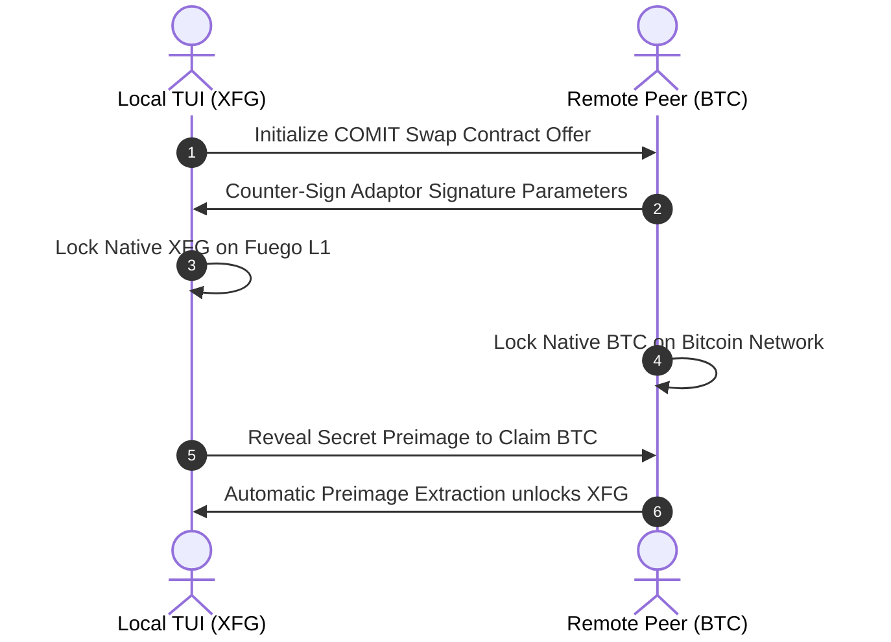

# Step-by-Step Tutorial: Managing Atomic Swaps & Nodes via the Fuego TUI

For developers, system administrators, and absolute privacy advocates, modern heavy web wrappers (Electron/React apps) introduce unnecessary attack surfaces, telemetry leakage, and resource consumption. 

**Fuego v1.10.00 "AzorAhai"** features a complete, standalone, zero-JS **Terminal User Interface (TUI)** written natively in Go. This tutorial provides comprehensive guidance on bootstrapping your local setup, navigating the dual-asset terminal interface, providing on-chain liquidity, and orchestrating trustless cross-chain atomic swaps directly from your shell.

---

## Prerequisites & Compilation

To ensure maximum cryptographic security and binary determinism, users are encouraged to compile the terminal client locally using standard Go tooling.

### System Requirements
* Operating System: Linux, macOS, or Windows (WSL2 recommended)
* Go Runtime: **v1.24+**
* C++ Toolchain: Standard `build-essential` or `clang` required for backend node core IPC compilation.

### Step 1: Clone and Compile
Navigate to the root directory of your project workspace and build the terminal target:

```bash
# Clone source repository (ensure recursive submodule initialization)
git clone --recursive https://github.com/fuego-project/xfgo.git
cd xfgo

# Compile the terminal binary target via the integrated Makefile
make build-tui
```

Upon successful compilation, the optimized terminal executable will be deposited directly into your `build/bin/` folder as `fuego-tui`.

---

## Navigating the Terminal Workspace

Launch the interface by pointing the binary to your active synchronization node RPC port (or run in embedded local daemon mode):

```bash
./build/bin/fuego-tui --daemon-address=127.0.0.1:18081 --colors=true
```

### The Interface Layout

```
┌────────────────────────────────────────────────────────────────────────┐
│ [Fuego AzorAhai v1.10.00]    Active Network: MAINNET    Peers: 24/32   │
├────────────────────────────────┬───────────────────────────────────────┤
│ Navigation (Tab / Vim Keys)    │ Workspace: Active Wallet              │
│ > 1. Wallet Overview           │                                       │
│   2. Mint HEAT (Burn2Mint)     │ Primary Address:                      │
│   3. Hearth L1 AMM Interface   │ Fg7x...3k9a                           │
│   4. Atomic Swap Engine        │                                       │
│   5. Node Diagnostics          │ Balances:                             │
│                                │   [XFG Reserve]: 1,240.50 XFG         │
│                                │   [HEAT Cash]  : 5,000.00 HEAT        │
├────────────────────────────────┴───────────────────────────────────────┤
│ Log Output: [INFO] Successfully synced block header 842,900 (Epoch 936)│
└────────────────────────────────────────────────────────────────────────┘
```

### Global Key Bindings
* `Tab` / `Shift+Tab`: Cycle active interface panels focus.
* `h`, `j`, `k`, `l` / `Arrow Keys`: Standard directional navigation within active menu lists.
* `Enter`: Confirm selection or trigger action form execution.
* `Ctrl+C` / `q`: Gracefully disconnect node RPC sessions and exit to OS shell.

---

## Executing Core Protocol Operations

### Operation 1: Burning XFG to Mint HEAT Cash
To convert your volatile collateral reserves into programmatic algorithmic stable assets:

1. Use `j` to highlight **2. Mint HEAT (Burn2Mint)** and press `Enter`.
2. Enter the target amount of base-layer **XFG** to consume. The system automatically reads the current dynamic Q64.64 PI Controller `RedemptionPrice` off the blockchain state.
3. Review the output execution preview:
   ```text
   Consuming        : 100.00 XFG
   Current L1 Price : 0.20 XFG / HEAT
   Expected Output  : 500.00 HEAT (assetId=0x01)
   ```
4. Press `Enter` to sign and push the irreversible conversion transaction. Once included in the block, your updated per-asset balance will reflect immediately in the overview pane.

---

### Operation 2: Supplying Liquidity to the Hearth AMM
Earn sustainable L1 real-yield by pairing your reserves directly into the decentralized consensus layer:

1. Navigate to **3. Hearth L1 AMM Interface**.
2. Select the **[Add Liquidity]** execution tab.
3. Input your desired base asset depth. Because Hearth enforces strict constant-product invariants ($X \times Y = K$), the terminal client dynamically queries the exact required secondary ratio using `getAmmQuote` RPC calls.
4. Confirm deposit execution. The pool issues equivalent internal L1 LP shares, entitling your address to continuous pro-rata accumulation of the network's flat **1% swap fees**.

---

### Operation 3: Conducting Peer-to-Peer Atomic Swaps
Fuego supports zero-counterparty risk, cross-chain atomic swaps (e.g., swapping native XFG directly for external Bitcoin or Monero outputs) using cryptographic adaptor signatures integrated into the terminal backend.



#### Step-by-Step Swap Flow:
1. Open the **4. Atomic Swap Engine** panel.
2. Select **[Initiate Swap Offer]** and provide your counterparty's network routing descriptor (I2P address or direct node multiaddr).
3. Specify the swap parameters (e.g., offering `500.00 XFG` for `0.025 BTC`).
4. The terminal engine automatically negotiates the cryptographic lock time boundaries and constructs the verification adapter script.
5. Once both parties broadcast their respective initialization locks, monitor the auto-extracting progress bar inside the interface until final output settlement completes.

---

## Troubleshooting & Verification

* **Symptom**: `Error: assetId mismatch during output discovery`
  * **Resolution**: Verify that your terminal client binary is built against the **v1.10.00** codebase header containing updated `CryptoNoteSerialization.cpp` multi-asset decoding routines.
* **Symptom**: High slippage warnings during AMM liquidity provisioning.
  * **Resolution**: If the global TWAP spot price diverges sharply from your local node's cache, run `5. Node Diagnostics -> Rebuild Sync Cache` to purge stale mempool states.

<script type="application/ld+json">
{
  "@context": "https://schema.org",
  "@type": "HowTo",
  "name": "How to Operate the Fuego Dual-Asset Terminal User Interface (TUI)",
  "description": "Step-by-step instructions for compiling the Go TUI binary, managing multi-asset outputs, adding Hearth AMM liquidity, and executing trustless atomic swaps.",
  "step": [
    {
      "@type": "HowToStep",
      "name": "Clone and Compile",
      "text": "Clone the source repository and run make build-tui to compile the terminal executable."
    },
    {
      "@type": "HowToStep",
      "name": "Launch Terminal Client",
      "text": "Execute the binary pointing to your active daemon RPC endpoint to load the dual-asset workspace."
    },
    {
      "@type": "HowToStep",
      "name": "Execute Protocol Operations",
      "text": "Navigate menus using Vim bindings to mint HEAT stable assets, provide constant-product liquidity, or run atomic swaps."
    }
  ]
}
</script>
