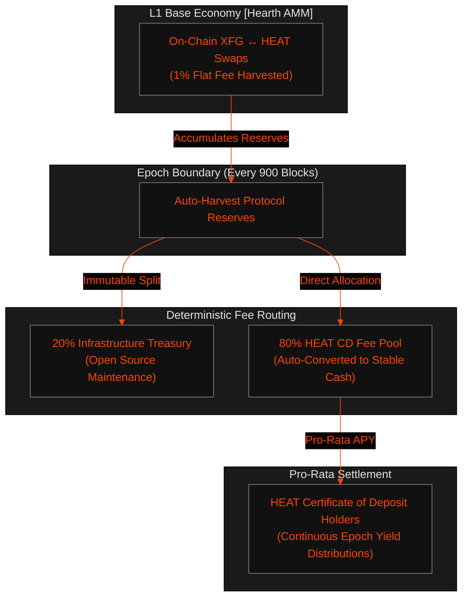

# How to Earn Sustainable Real Yield with Crypto Certificates of Deposit

The vast majority of decentralized finance (DeFi) yield protocols operate as zero-sum ponzi schemes. They issue highly inflationary, governance-farmed tokens to bootstrap temporary liquidity, resulting in massive supply dilution, capital flight, and eventual token devaluation.

**Fuego v1.10.00 "AzorAhai"** introduces a fundamentally sovereign alternative: **Crypto Certificates of Deposit (CDs)** backed by pure, unadulterated **Real Yield**. Rather than printing new units out of thin air, Fuego CDs capture programmatic transaction fees directly from native base-layer economic activity.

This manual outlines the architectural pipeline of the **Hearth AMM fee accumulator**, details the deterministic math behind the **80/20 allocation loop**, provides an illustrative APY projection matrix, and demonstrates how to deploy and manage compounding CD strategies via direct terminal RPC access.

---

## 1. The Real Yield Infrastructure: Hearth AMM

Fuego operates a native constant-product Automated Market Maker directly inside its consensus execution rules: the **Hearth AMM** ($R_{\text{xfg}} \times R_{\text{heat}} = K$). 

Every exchange executed across this embedded pool incurs a non-negotiable **1% (100 bps) swap fee**. Because the AMM is built directly into the L1 block verification layer (`AmmPool.cpp`), these fees cannot be intercepted, re-routed, or captured by centralized third-party aggregators.

### The Automated 80/20 Accumulation Cycle



At the completion of every **Epoch Boundary** (precisely **900 blocks** on Mainnet, or **10 blocks** on Testnet), the block producer executes an automated, trustless settlement transaction:
1. **80% of all accumulated fees** are injected directly into the **HEAT CD Fee Pool**. If swap fees were captured in base-layer XFG collateral, the protocol automatically swaps them against the Hearth AMM to settle yields purely in non-volatile algorithmic **HEAT**.
2. **20% of accumulated fees** are directed to the **Fuego Treasury** to ensure absolute long-term financial self-sufficiency for core contributors and audit groups.

---

## 2. Yield Distribution & Epoch Math

Unlike standard staking mechanics that require daily claiming gas costs, Fuego CDs calculate reward entitlements continuously over distinct epoch buckets.

### Individual Reward Entitlement Formula

During any given epoch $E$, your CD deposit's pro-rata claim is determined by its asset weight relative to the global active CD tree:

$$\text{UserClaim}_E = \text{TotalPoolFees}_E \times \left( \frac{\text{Principal}_{\text{user}}}{\sum \text{Principal}_{\text{active}}} \right)$$

Because fee distribution is settled entirely in algorithmic **HEAT Cash**, stakers are completely immunized against the base asset fiat volatility swings that typically erode yield valuations in standard crypto pools.

---

## 3. Illustrative APY Projections Matrix

To assist capital allocators and node operators in mapping expected returns, the following matrix models annualized percentage yields (APYs) under highly conservative, moderate, and hyper-active daily trading volumes.

> [!NOTE]
> **Deterministic Parameters**
> * Base CD Pool TVL: **1,000,000 HEAT**
> * Mainnet Block Target: **60 seconds** (900 blocks $\approx$ 15 hours per Epoch)
> * Native Swap Fee: **1.0%** (80% routed to stakers $\rightarrow$ **0.8% net capture**)

| Market Condition | Daily Swap Volume | Daily Fee Capture (Net) | Epoch Fee Pool Inflow | Projected Annualized APY |
| :--- | :--- | :--- | :--- | :--- |
| **Dormant / Bootstrapping** | 50,000 HEAT | 400 HEAT | 250 HEAT | **14.60%** |
| **Moderate Baseline** | 250,000 HEAT | 2,000 HEAT | 1,250 HEAT | **73.00%** |
| **High Arbitrage Activity** | 1,000,000 HEAT | 8,000 HEAT | 5,000 HEAT | **292.00%** |

*Disclaimer: Projections represent deterministic calculations derived from fixed mathematical parameters. Actual returns scale linearly with active global network utility and trade volume.*

---

## 4. Deploying & Compounding via Terminal CLI

Operating natively without vulnerable web frontends, users can lock capital, query yields, and execute autocompounding rollovers directly via local node RPC execution.

### Step 1: Querying Active Fee Pool Metrics
Verify the current financial state of the epoch pool before allocating capital:

```bash
curl -s -X POST http://127.0.0.1:18183/json_rpc \
  -H 'Content-Type: application/json' \
  -d '{
    "jsonrpc": "2.0",
    "id": "0",
    "method": "get_fee_pool_info",
    "params": {}
  }' | jq .
```

*Expected JSON output highlighting active reserves:*
```json
{
  "jsonrpc": "2.0",
  "result": {
    "current_epoch_number": 936,
    "current_epoch_swap_fees": 4250000000,
    "current_epoch_blocks_remaining": 142
  }
}
```

### Step 2: Creating a Real-Yield Certificate of Deposit
Lock **HEAT Cash** into a time-bound cryptographic commitment. The second argument dictates term duration measured in epochs (e.g., locking for `6` epochs $\approx$ 3.75 days):

```bash
# Using Fuego suite local daemon integration
./fuego_suite --testnet
# Navigate workspace -> Select 'Create CD Commitment'
```

Alternatively, push the raw structure via wallet rpc calls:
```bash
curl -s -X POST http://127.0.0.1:18183/json_rpc \
  -H 'Content-Type: application/json' \
  -d '{
    "jsonrpc": "2.0",
    "id": "0",
    "method": "create_cd_deposit",
    "params": {
      "amount": 50000000000,
      "term_epochs": 6
    }
  }'
```

### Step 3: Compounding via Rollover Commitments
To maximize capital growth, Fuego implements an internal **Rollover Engine** (`rollover_deposit`). Instead of withdrawing principal to a standard address and paying re-deposit transaction fees, stakers can seamlessly roll maturing principal plus accumulated real-yield interest directly into a new commitment:

```bash
curl -s -X POST http://127.0.0.1:18183/json_rpc \
  -H 'Content-Type: application/json' \
  -d '{
    "jsonrpc": "2.0",
    "id": "0",
    "method": "rollover_deposit",
    "params": {
      "deposit_id": "cd_8f2b1a9c",
      "new_term_epochs": 12
    }
  }'
```

Because your initial **HEAT** principal expands directly by the captured swap fee outputs, the next epoch calculation processes against the compounded sum, triggering exponential interest accumulation over multi-month staking parameters.

---

## Summary: A Zero-Slippage Sovereign Income Asset

By routing core base-layer liquidity demand through an integrated AMM and directly piping harvested swap transaction fees to time-locked savers, Fuego provides an exceptionally secure financial instrument. Users gain stable principal preservation, complete privacy isolation, and a continuous stream of yield derived from tangible real-world platform utility.

<script type="application/ld+json">
{
  "@context": "https://schema.org",
  "@type": "TechArticle",
  "headline": "How to Earn Sustainable Real Yield with Crypto Certificates of Deposit",
  "description": "Comprehensive tutorial detailing Fuego's native Hearth AMM 1% swap fee routing, 80/20 fee distribution parameters, epoch math, and terminal RPC command pipelines.",
  "author": {
    "@type": "Organization",
    "name": "Fuego Core Implementation Guild"
  },
  "publisher": {
    "@type": "Organization",
    "name": "Fuego Foundation"
  },
  "datePublished": "2026-05-14"
}
</script>
